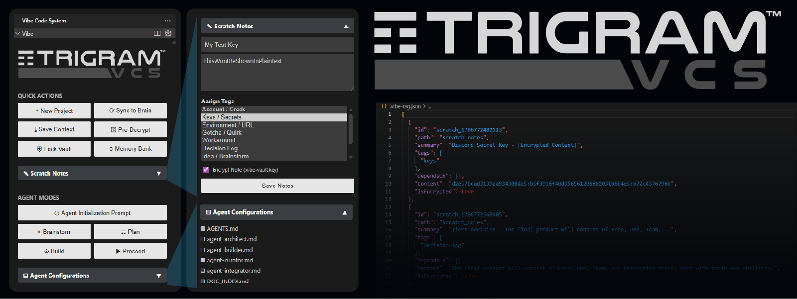
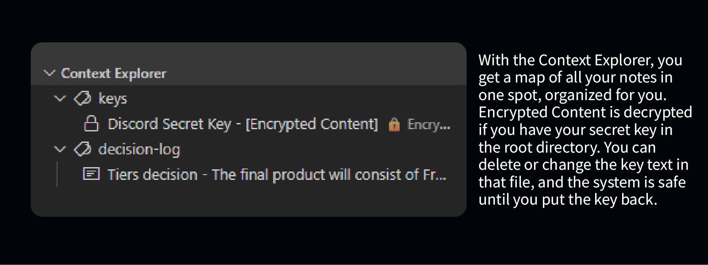

# ▤ Trigram Vibe Code System

🇯🇵 <strong>日本語 (Japanese) のREADMEを表示 (クリックで展開)</strong>

---

# ▤ Trigram Vibe Code System

Trigramの **Vibe Code System (VCS)** へようこそ。VS Code向けのコンテキスト対応型AIワークフロー拡張機能です。

Vibe Code Systemは、AIコーディングアシスタント（Cline、Cursor、Antigravityなど）が盲目的にコードを実行するのを防ぎ、協調的なパートナーとして機能するように制御します。エディタ内で厳密な3フェーズの開発ワークフロー、コンテキストの保存、メモリバンク、およびローカルRAGインデックスを実装します。

私たちは、新規プロジェクトの立ち上げや、AIエージェントが特定のタスクをより良く実行できるようにするために、自分たちでこれを使用しています。あなたにとっても同じように役立つことを願っています。

## ▤ 主な機能

- **厳密なエージェント制御 (`✧ Brainstorm`, `☷ Plan`, `⚙ Build`, `▶ Proceed`)**: エージェントの暴走を防ぐワークフローを強制します。AIは制限されており、開発フェーズを進めるにはユーザーの明示的な承認を得る必要があります。
- **⏻ Agent Initialization Prompt**: 新しい会話やセッションの開始時に、AIエージェントを一発で接地・同期させるための4ステップ初期化プロンプトをワンクリックで生成・コピーします。
- **暗号化されたVault (`⚿ Pre-Decrypt` / `⛨ Lock Vault`)**: 環境変数、APIキー、機密データを `.vibe-vault.key` でAES-256暗号化して安全に保存します。日本語や多言語パスフレーズ、コメント行（`#`）に対応し、終了後は `⛨ Lock Vault` で平文シークレットを即座に破棄できます。
- **Context Explorer とスクラッチノート管理**: ドキュメントとスクラッチノートのタグ別整理、インラインでのワンクリックコピーや削除、階層表示を提供します。
- **ローカルRAGと重み付けセマンティック検索**: サブディレクトリ（`docs/core/` など）を含む全ドキュメントを再帰的にインデックス化し、タグ・概要・ファイルパス・本文の重要度に応じた高精度なスコアリング検索を実行します。
- **常設CLI同期ツール (`npm run vibe:sync`)**: エージェントも開発者も、単一のコマンド `node .agents/vibe-sync.js` でワークスペース全体をインデックス化・同期できます。
- **既存プロジェクトの移行 (`☷ Convert to VCS`)**: 既存のコードベースを非破壊でTrigram VCSに移行します。既存の `.md` ドキュメントを `docs/pre-existing/` に自動アーカイブし、Git履歴を保持したまま複製する安全クローン (`<name>-VCS`) またはインプレース統合を選択可能。移行完了時に専用のAI初期化プロンプトをクリップボードに自動コピーします。
- **クイックスキャフォールディング (+ Git自動初期化 & UIVerse対応)**: `+ New Project` を使って、`.agents`、規範ドキュメント、`.gitignore`、Gitリポジトリ、および UIVerse.io Design System（`DESIGN.md` / `system.css` / `preview.html`）の初期化を即座に実行します。
- **スキャフォールドテンプレート & 保管庫 (`*.vcs.zip`)**: プロジェクト設定を再利用可能なテンプレートとして保存・共有。ローカルまたはネットワーク共有の保管庫に対応し、複数ソースからのファイル/フォルダ同梱（サブフォルダ包含、空フォルダ構造のみの作成）、AES-256-GCMによる全ペイロードのパスワード保護、およびマスターVaultキーの完全除外（漏洩ゼロ）を保証します。
- **ダイレクト設定アクセス (`⚙`)**: サイドバーヘッダーおよびタイトルバーからワンクリックでVCS拡張機能設定に直接アクセスできます。
- **Antigravity 2.0 & CLI カスタムエージェント対応**: `vibe-architect`、`vibe-builder`、`vibe-curator`、`vibe-integrator` のYAMLフロントマターを標準搭載。

## ▶ 使い方

1. VCSサイドバーの **+ New Project** で新規プロジェクトを生成するか、**☷ Convert to VCS** をクリックして既存のプロジェクトを安全にVCS対応へと移行します。
2. **⏻ Agent Initialization Prompt**（または移行時にコピーされたプロンプト）をAIチャットに貼り付けてエージェントを接地します。
3. アーキテクチャ関連のドキュメントを `docs/` フォルダに保存し、**⟳ Sync to Brain**（または `npm run vibe:sync`）でローカルRAGデータベース (`.vibe-rag.json`) にインデックス化します。
4. **Agent Mode**（`✧ Brainstorm`、`☷ Plan`、`⚙ Build`）をクリップボードにコピーしてAIプロンプトに貼り付け、開発フェーズを厳格に制御します。
5. 作業完了時は **⛨ Lock Vault** をクリックして、一時的な平文シークレットファイルを安全に破棄します。

## ▤ ロードマップ & 今後のエディション

- **Community Edition (無料 / OSS)**: 100%オフライン、ローカルRAG、ローカルAES-256暗号化Vault、3フェーズワークフロー、スキャフォールドテンプレート保管庫、既存コードベース移行。
- **Vibe Pro (近日登場)**: 複数デバイス間での暗号化クラウド同期、Vaultのゼロ知識バックアップ、クロスプロジェクト検索。
- **Vibe Team (近日登場)**: チーム間でのスクラッチノート共有、チーム共有RAGインデックス、組織全体の統一エージェントガバナンス。
- **Vibe Enterprise (近日登場)**: AWS Secrets Manager / HashiCorp Vault / GCP KMS とのゼロ知識シークレット連携、SSO/SAML認証、監査ログ。

---

Welcome to Trigram's **Vibe Code System (VCS)**, a contextual AI workflow extension for VS Code.

Vibe Code System forces AI coding assistants (like Cline, Cursor, Antigravity, and others) to stop blindly executing and start acting like a collaborative partner. It implements a strict 3-phase development workflow, context saving, a Memory Bank, and local RAG indexing right inside your editor.

We use it ourselves to assist in spooling up new projects and guiding our AI agents to perform predictably on complex tasks. We hope it does the same for you.

## ▤ Features

- **Strict Agent Workflow Controls (`✧ Brainstorm`, `☷ Plan`, `⚙ Build`, `▶ Proceed`)**: Enforce a gated workflow that prevents agent hyperactivity. The AI is restricted and must receive user permission to proceed between divergence, planning, and implementation.
- **⏻ Agent Initialization Prompt**: Kickstart and ground any AI agent session in seconds with a single click, providing the agent with workspace rules, memory querying commands, and operational boundaries.
- **Existing Project Migration (`☷ Convert to VCS`)**: Seamlessly transition existing codebases into the Trigram VCS framework non-destructively. Choose between in-place merging or safe cloned workspaces (`<name>-VCS`) with `.git` history preserved. Automatically archives pre-existing markdown to `docs/pre-existing/`, sets up the Encrypted Vault, and copies a specialized transition prompt to your clipboard.
- **Scaffold Templates & Storehouse (`*.vcs.zip`)**: Rapidly save and load reusable project setups stored in local or network storehouses. Includes a Multi-Source File & Folder Asset Bundler (`+ Add File(s)`, `+ Add Folder`, `Include Subfolders`, `Only copy folder structure (no files)`), full-payload AES-256-GCM password encryption, automatic form prefilling, and guaranteed exclusion of master vault keys (`INV-005`/`INV-006`).
- **Encrypted Vault Lifecycle (`⚿ Pre-Decrypt` / `⛨ Lock Vault`)**: Store environment variables, API keys, and sensitive notes with AES-256 encryption. Supports multi-language passphrases, `#` comment headers, and immediate plaintext secret purging.
- **Context Explorer & Scratch Notes Management**: Tree-view explorer grouping notes by semantic tags (`architecture`, `keys`, `gotchas`), with direct inline copy (`$(clippy)`) and delete (`$(trash)`) context menu controls.
- **Recursive RAG Indexing & Weighted Semantic Search**: Recursively indexes all workspace documentation (including `docs/core/`) and ranks queries with weighted scoring prioritizing semantic tags (+5), file paths (+4), and summaries (+3) over raw body text.
- **Permanent Indexing CLI Tool (`npm run vibe:sync`)**: One-command synchronization via `node .agents/vibe-sync.js` that updates `.vibe-rag.json` and `.vibe-tracker.md` while preserving scratch notes, project metadata, and vault secrets.
- **UIVerse.io Design System Directives**: Optional one-click scaffolding for `DESIGN.md`, `system.css`, and `preview.html` integration, providing strict AI token enforcement when building Web UIs.
- **Direct Settings Shortcut (`⚙`)**: Instant access to extension settings from the sidebar title bar and webview header without menu hunting.
- **Antigravity 2.0 & CLI Custom Agent Support**: Ready-to-use role definitions and YAML frontmatter headers for `vibe-architect`, `vibe-builder`, `vibe-curator`, and `vibe-integrator`.
- **Project Scaffolding (+ Git Auto-Init)**: Instantly generate complete project foundations with `+ New Project`, creating `.agents/`, canonical `docs/core/`, secret-protected `.gitignore`, and initializing Git baseline commits automatically.
- **Context Preservation (`⤓ Save Context`)**: Export AI conversation artifacts from IDE brain paths into persistent, human-readable markdown in `docs/` with automated Git tracking.

## ▶ Getting Started

1. Click **+ New Project** to scaffold a fresh project, or click **☷ Convert to VCS** to non-destructively migrate an existing project into Trigram VCS.
2. Click **⏻ Agent Initialization Prompt** (or paste the copied transition prompt) into your AI agent's chat to ground it.
3. Place architectural specifications in `docs/` and click **⟳ Sync to Brain** (or run `npm run vibe:sync`) to index into the local RAG database (`.vibe-rag.json`).
4. Control the agent's phase using the **Agent Modes** buttons (`✧ Brainstorm` -> `☷ Plan` -> `⚙ Build`).
5. When finished working with sensitive notes, click **⛨ Lock Vault** to purge decrypted plaintext files.

## ▤ Roadmap & Upcoming Editions

- **Community (Free / OSS)**: 100% local, offline-first, local RAG database, AES-256 encrypted vault, and 3-phase multi-agent governance.
- **Vibe Pro (Coming Soon)**: Multi-device cloud sync, encrypted zero-knowledge vault backups, and cross-project semantic search.
- **Vibe Team (Coming Soon)**: Shared team scratch notes with asymmetric team encryption, team RAG index, and unified workspace rules.
- **Vibe Enterprise (Coming Soon)**: Zero-knowledge remote secret broker (AWS Secrets Manager / HashiCorp Vault / GCP KMS), SSO/SAML 2.0, audit logging, and air-gapped VPC deployments.

## ▤ Supported Languages

VCS UI commands, sidebars, and notifications are natively translated into:
**English**, **German** (Deutsch), **Spanish** (Español), **Finnish** (Suomi), **French** (Français), **Italian** (Italiano), **Japanese** (日本語), **Korean** (한국어), **Malay** (Bahasa Melayu), **Dutch** (Nederlands), **Polish** (Polski), **Portuguese** (Português), **Russian** (Русский), **Swedish** (Svenska), **Ukrainian** (Українська), and **Simplified Chinese** (简体中文).

## ▤ Support the Project

If this extension supercharges your workflow, consider supporting the creator! And please, send an email to me at don@trigr.am if you have a story to share. Thanks!

